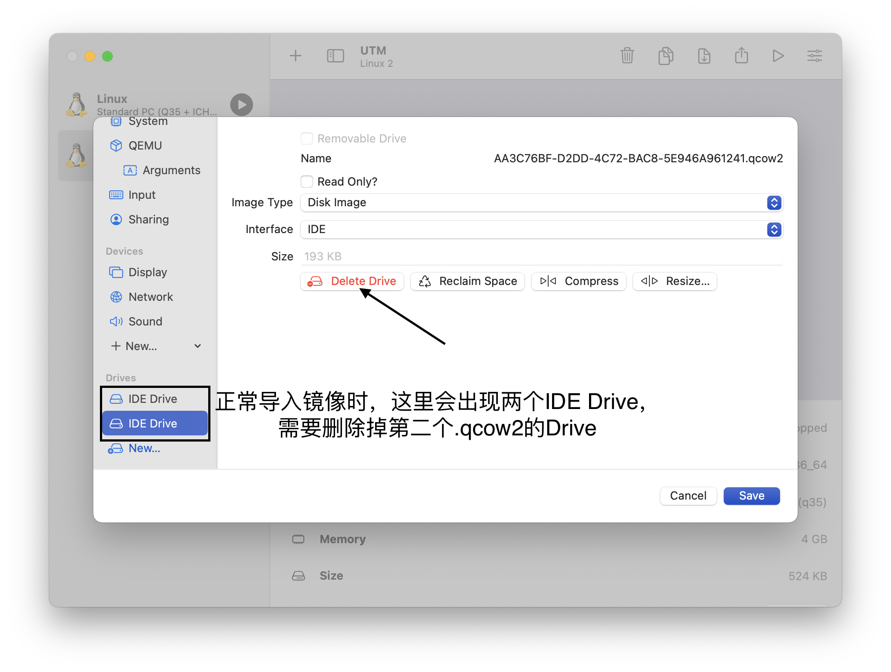
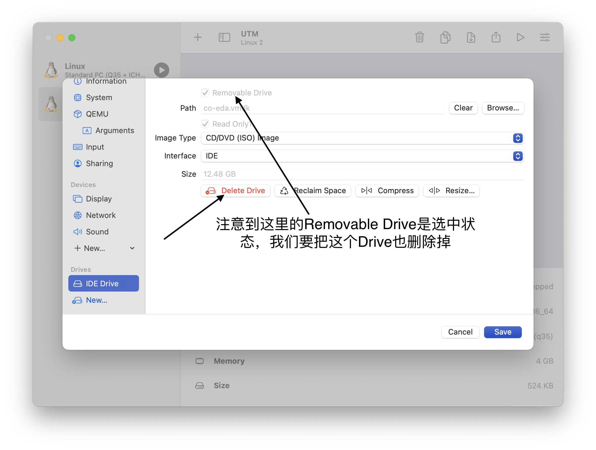
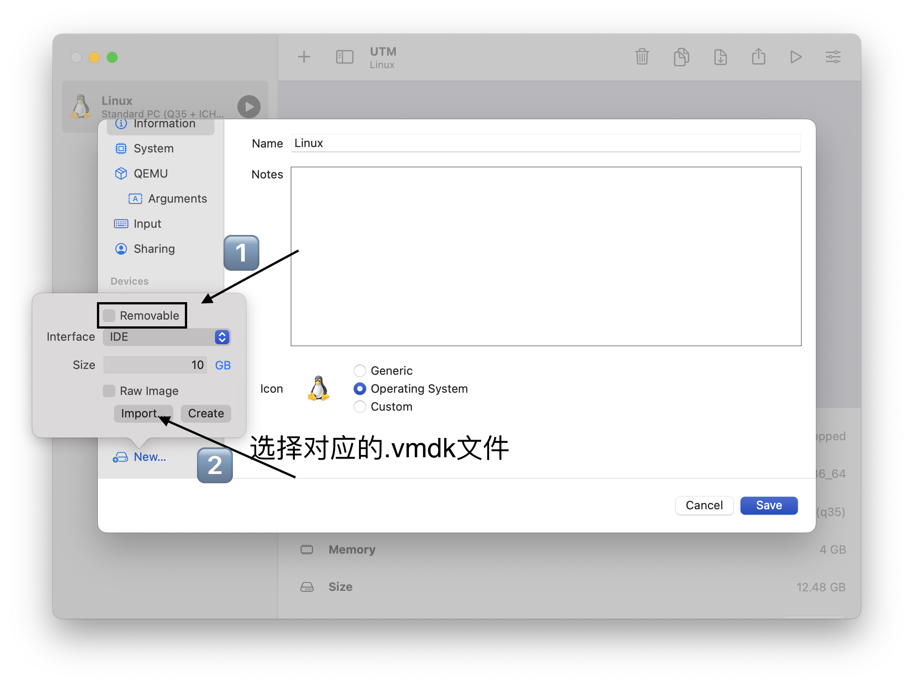
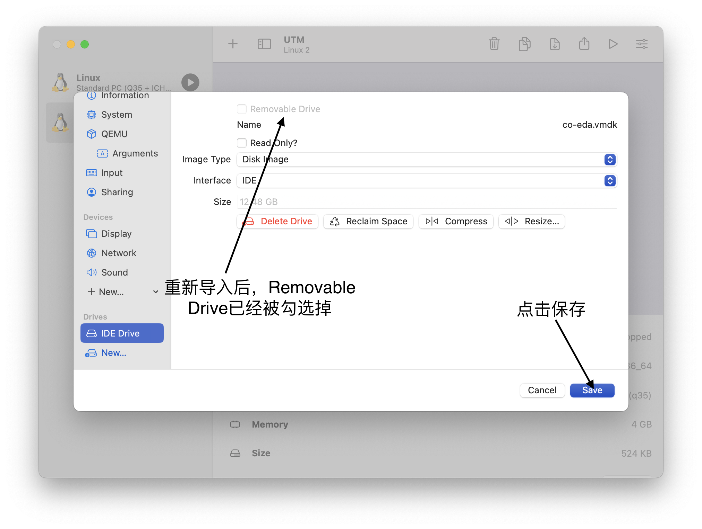
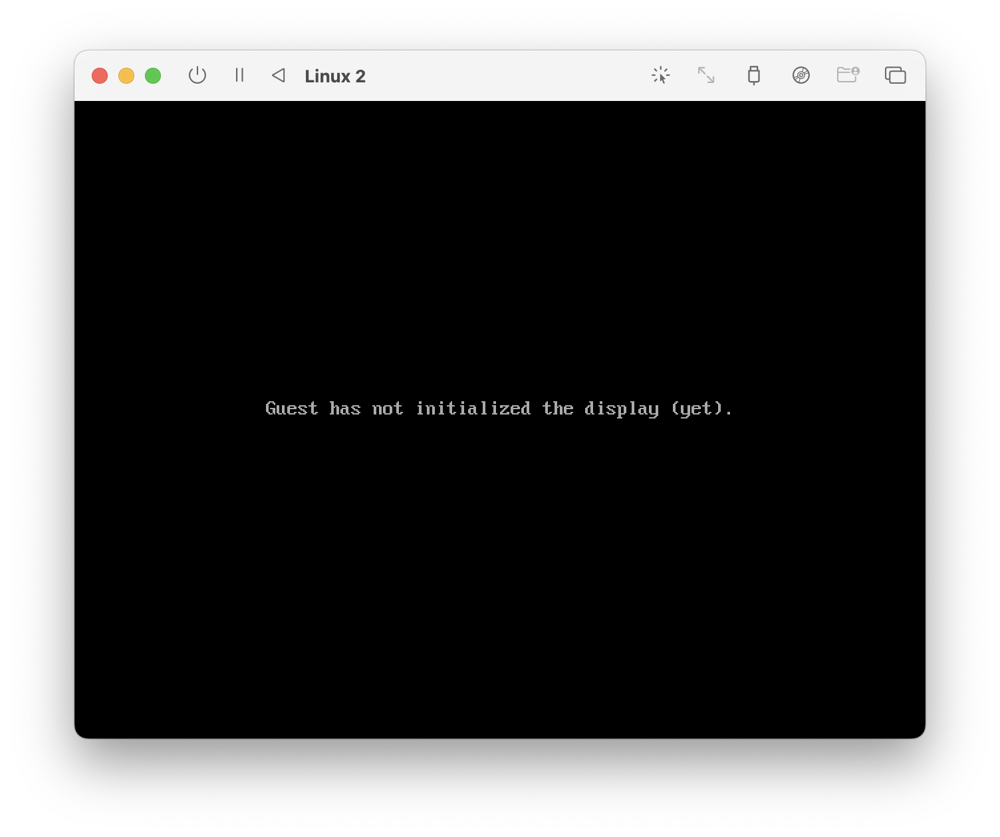
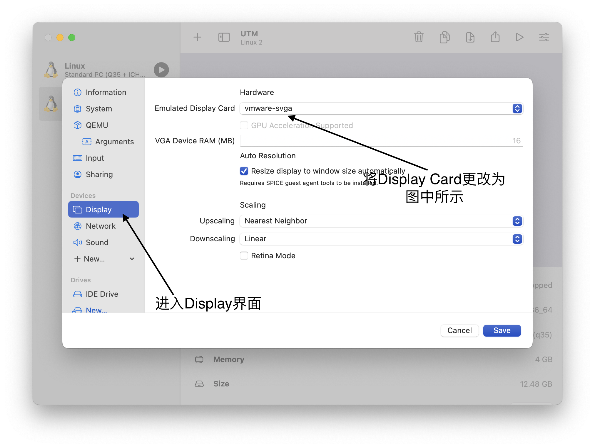
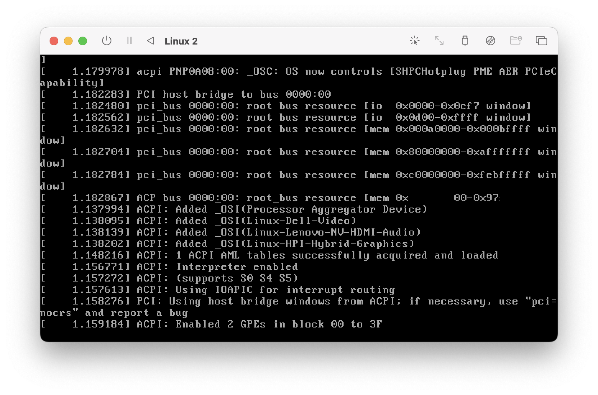

# 关于M系列芯片MacBook使用虚拟镜像的一些解决方案

snow
|
<abbr title="2023-08-11T18:34:43.030045+08:00"><time datetime="2023-08-11T18:34:43.030045+08:00">2023-08-11 18:34:43</time></abbr>
|
⭐️ 2
|
💬️ 1
 

分享

snow

本人使用的是搭载M2芯片的MacBook，之前使用UTM按照教程安装镜像时一直出现问题，由于在讨论区看到有其他同学也遇到相同的问题，故决定将解决过程发布在讨论区。

经尝试，在安装后需手动勾选掉“Removable Drive”这一选项。详细过程见下图。

删除掉原有的两个IDE Drive后，单击左下角的New新建一个Drive。

在本机尝试的过程中，单击保存后会等待一段时间。

这时再启动刚才导入的镜像，会发现出现如上图界面，这时需要重新进入设置。

再单击保存，重新启动镜像。

成功启动。如果感觉启动后运行速度较慢，CPU占用过高的话，可以在设置中将CPU core设置为4核或更多(勾选Force Multiple)

<abbr title="2023-08-11T18:34:43.117838+08:00"><time datetime="2023-08-11T18:34:43.117838+08:00">2023-08-11 18:34:43</time></abbr>
|
保留所有权利
❤️ 9

